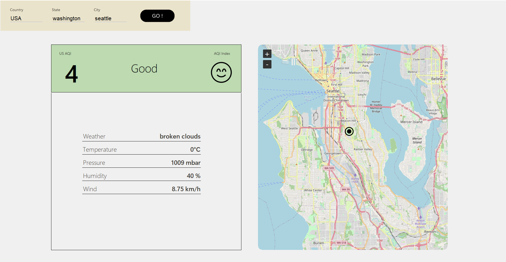

# Resource 📜
[API Data resource](https://www.iqair.com/air-pollution-data-api)

# Required Python Modules 📚

> PYTHON AND PIP REQUIRED ❗

→ Tkinter
`pip install tkinter `
[Tkinter Documentation](https://docs.python.org/3/library/tkinter.html)

→ tkintermapview
`pip install tkintermapview `
[tkintermapview Documentation](https://github.com/TomSchimansky/TkinterMapView)

→ requests
`pip install requests`
[requests Documentation](https://requests.readthedocs.io/en/latest/)

 

# How To Play 🕹️

1. Run app.py (maximize the screen for better view)
2. Try to put :
      - Country as indonesia
      - State as west java
	  - City as Bandung
3. Dont forget to click `GO` button to see the results